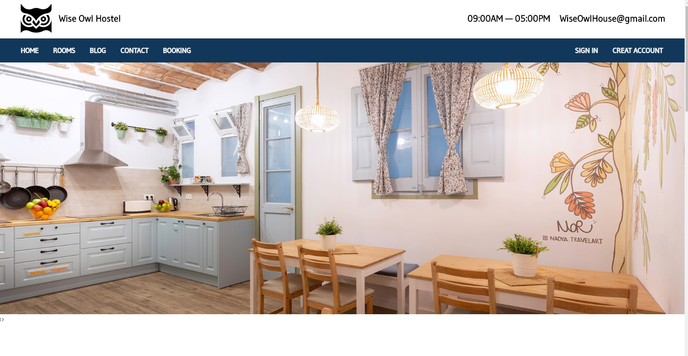
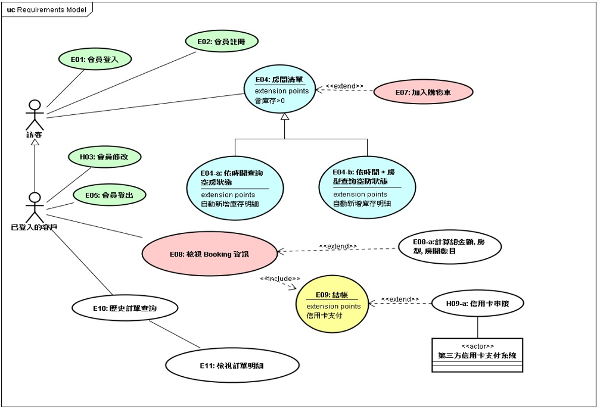
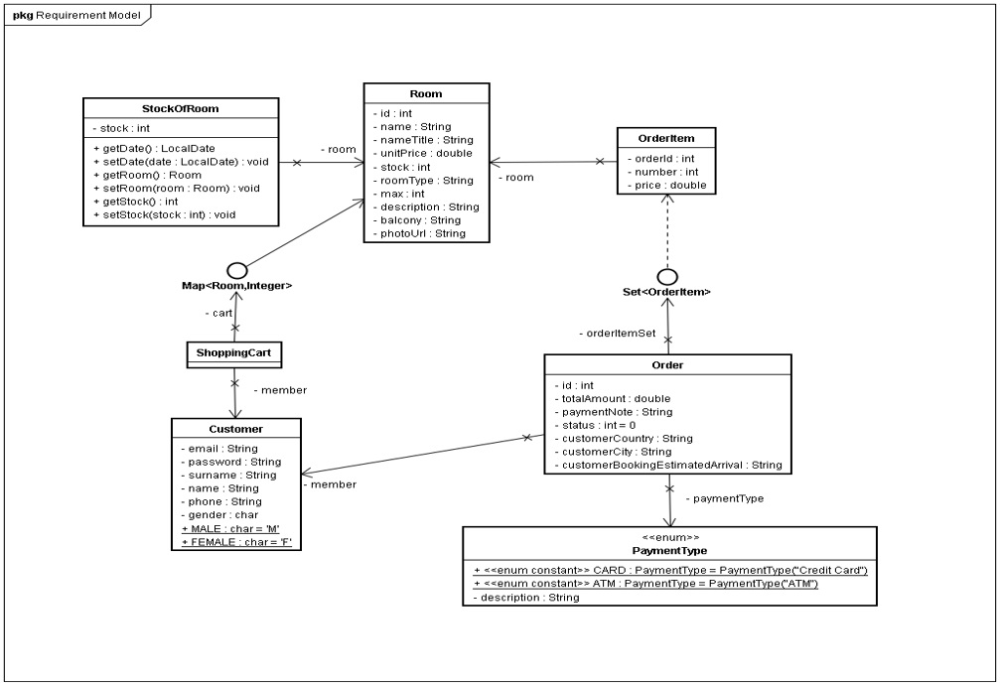
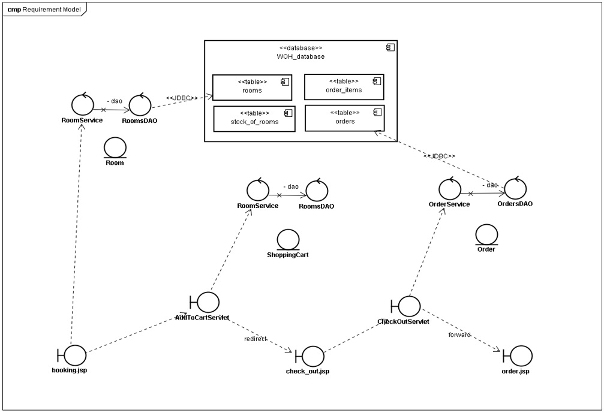

# WiseOwlHostel  
It is a website for providing a hostel’s booking
service. I used Java web-technology to
develop the mean functions. It includes
member management system, and booking
system. The most complicated part is the
design of inventory management. I created
temporary table by SQL to deal with it.

## Home Page  

## Use Case Diagram

## Class Diagram

## Component Diagram

